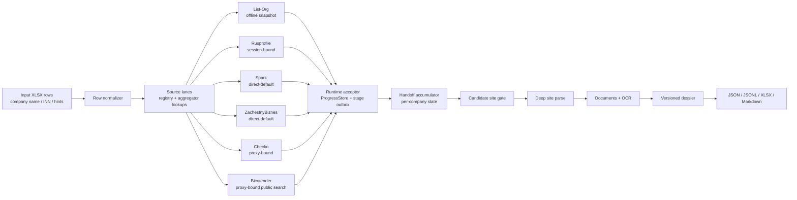

# Russian Company Enrichment Demo

Public demo of a production-grade Russian company enrichment system.

The full project was built for an NDA-covered customer workflow. This repository is a sanitized demo version: it keeps the engineering shape, source integrations, runtime architecture, tests, and core parsing ideas, but excludes customer data, credentials, proxy inventory, private prompts, scoring rules, generated run outputs, and outreach templates.

In one sentence: the system turns a company identifier into a traceable research dossier and a caller-ready lead table.

For Russian companies, the usual starting point is an `INN` - the Russian Taxpayer ID, a unique company identifier similar to a national business registration/tax number. The pipeline can also start from company names, workbook rows, websites, phone numbers, emails, and free-form operator notes.

## Why This Exists

Ordinary company databases and tender aggregators are not enough for this use case.

The goal is not just to scrape public registries. The goal is to find commercially useful companies, reliable contacts, real websites, procurement traces, surplus-sale signals, industrial activity, and evidence that a human caller can trust.

Russian industrial data is messy:

- companies have stale legal records and outdated aggregator contacts;
- official websites are often old, broken, CP1251-encoded, or partially JS-rendered;
- useful signals are hidden under weak labels like realization, surplus stock, non-liquid assets, TMC, MTR, dismantling, scrap, warehouse leftovers, and procurement documents;
- relevant evidence is split across HTML pages, PDFs, DOC/XLS files, scans, subdomains, archives, and tender portals;
- some sources are session-bound, proxy-bound, slow, rate-limited, or intermittently unavailable;
- a useful lead is often not obvious from the company name alone.

This project was designed around that reality.

## What The Full System Does

The production system takes an input workbook and builds a multi-source company profile for each row.

It collects and reconciles:

- legal company name and INN;
- legal and detected addresses;
- phones, emails, and websites;
- OKVED activity codes and readable activity descriptions;
- public profile links and source URLs;
- management and founder availability when exposed by public sources;
- candidate official websites and evidence for why each site does or does not belong to the company;
- public website pages related to contacts, procurement, tenders, sales, production, documents, news, and company details;
- public tender/search-result signals from Bicotender;
- document evidence from PDFs, DOC/DOCX, XLS/XLSX, archives, and scanned files when safe and configured;
- OCR output for scanned documents when enabled;
- confidence notes, snippets, timestamps, source errors, and replayable runtime events;
- final JSON/JSONL, XLSX, Markdown reports, and versioned company dossiers.

The final production deliverable can be a caller-facing Excel workbook: clean company rows, clickable links, readable OKVED, tender evidence on a separate sheet, human-readable reasons to call, queue priority, and no internal parser noise.

## Three Pipeline Layers

The full project is organized as layered passes instead of one giant scraper.

### 1. Aggregator And Registry Pass

This pass builds the base identity layer.

It uses public or locally authorized surfaces such as:

- List-Org from a local/offline snapshot;
- Rusprofile for legal data, contacts, websites, addresses, and OKVED;
- Spark signals available in the current access mode;
- ZachestnyBiznes profiles, contacts, activity codes, and related links;
- Checko public company cards when enabled.

The important design choice is reconciliation, not blind copying. The system keeps source provenance, normalizes contacts, compares websites and addresses, and preserves enough evidence to debug why a value was accepted.

### 2. Bicotender Signal Pass

This pass searches public no-login Bicotender result pages by INN and by configured keyword batches.

The target is not to bypass protected tender details. The useful signal is often simpler and more robust:

- does this company appear in public tender/search results;
- are there visible themes around scrap, surplus stock, used equipment, pipes, materials, dismantling, waste, procurement, or realization;
- are the visible titles commercially relevant or just noise;
- should this evidence raise, lower, or explain the lead priority.

The caller workbook keeps Bicotender details on a separate sheet, with internal workbook links from the main company row. That makes the main table readable while keeping evidence one click away.

### 3. Site And Deep Evidence Pass

This pass decides whether a candidate website is actually the company's site and then extracts useful public evidence from it.

The site layer includes:

- candidate site discovery from aggregators, email domains, workbook hints, and detected links;
- pre-parse trust gates to reject unrelated marketplaces, stale mirrors, or wrong companies;
- site class detection for old HTML, mixed JS, JS shells, antibot failures, timeouts, and legacy encodings;
- route planning for contacts, about pages, procurement, tenders, documents, news, production, catalogs, and sitemap-derived routes;
- bounded crawling with host and route budgets;
- attachment discovery and safe document parsing;
- OCR budget controls for scanned documents;
- compact LLM review surfaces for cases where raw heuristics are not enough.

The result is not just "site found". The result is a reasoned site decision with evidence and a compact set of useful records.

## Runtime Architecture

The production runtime is built like a controlled streaming system.

Instead of waiting for every source to finish in a single blocking row loop, the pipeline uses source lanes, downstream stage pools, queue families, handoff state, and append-only stage messages.



### The Central Acceptor

A key architectural piece is the runtime acceptor.

Every stage emits structured messages such as:

- `source_result_ready`;
- `candidate_site_found`;
- `site_gate_decision`;
- `deep_parse_done`;
- `company_completed`;
- `host_event`.

Those messages are appended to a stage-message outbox and folded into a per-company handoff state. This gives the system a constantly updated picture of each company while separate source and downstream workers keep moving.

That design makes the pipeline easier to resume, audit, and debug. If a stage fails, the system still knows what was already collected, what is pending, what was deferred, and which source or host caused pressure.

## Concurrency And Backpressure

The pipeline is not "async for speed at any cost". It uses bounded concurrency because the sources have different constraints.

Examples:

- offline sources can be read safely;
- session-bound sources stay serial to protect browser/session state;
- proxy-bound sources are limited by usable proxy capacity;
- direct-default sources can use bounded worker lanes;
- downstream stages have separate budgets for candidate sites, deep parsing, factory-site parsing, OCR, LLM review, and extra checks;
- host-level governors prevent one domain from dominating the run;
- ready queues apply backpressure when downstream work is full.

The runtime records throughput telemetry: queue depth, inflight work, completed work, wait pressure, blocked stages, host cooldowns, and backpressure reasons.

This matters because long enrichment jobs fail in boring ways: one source slows down, one host starts timing out, one downstream stage becomes saturated, or a required source becomes unavailable. The runtime makes those failure modes visible instead of turning them into mystery stalls.

## Evidence Quality

The system is designed to preserve "why" alongside "what".

For a final table row, the production version can explain:

- which source provided a website;
- why that website looks official or suspicious;
- which contacts came from trusted surfaces;
- which OKVED activity drove the priority;
- whether public Bicotender evidence exists;
- whether the company is within the target geography;
- which documents or pages support the commercial signal;
- why a row is high or low priority.

That traceability is what makes the output usable by humans. A caller should not see parser internals, batch names, raw runtime states, or vague messages like "looks industrial". They should see a short, concrete reason to call and links to the evidence.

## Data Products

The full project can produce:

- normalized per-company JSON;
- append-only JSONL result streams;
- runtime state and progress ledgers;
- source-level evidence records;
- versioned company dossiers;
- Markdown reports;
- final XLSX exports;
- caller-facing Excel workbooks with clickable evidence links and separate tender detail sheets.

The public demo keeps generated runtime folders out of git because local runs can contain customer data, credentials from the environment, cookies, private source URLs, or commercially sensitive findings.

## What Is Included In This Demo Repository

This repository keeps a representative engineering slice:

- source modules for public company-profile surfaces;
- Bicotender public-search integration;
- runtime state, progress, handoff, queue, and concurrency modules;
- site intelligence modules;
- factory-site parser components;
- document parsing and OCR integration points;
- report and workbook-generation utilities;
- tests for runtime behavior, source resilience, site gates, document budgets, OCR, telemetry, and parser contracts.

It is intentionally not a ready-to-run copy of the customer's production deployment.

## What Is Not Included

The following are excluded because of NDA, security, or data-safety reasons:

- customer workbooks;
- real run outputs;
- `.env` files;
- credentials, cookies, browser sessions, and API keys;
- proxy inventory;
- private prompts;
- final customer scoring rules;
- private outreach templates;
- protected tender details;
- login-only workflows;
- CAPTCHA bypasses;
- any customer-specific business logic that would identify the client or their target strategy.

## Engineering Highlights

- Multi-source enrichment with source provenance instead of one-off scraping.
- Bounded, observable runtime with resume support and append-only event history.
- Source-specific transport policy: offline-only, session-bound, direct-default, and proxy-bound.
- Backpressure-aware source lanes and downstream stage pools.
- Central stage-message acceptor that continuously assembles per-company state.
- Site authenticity checks before expensive deep parsing.
- Legacy Russian website handling, including old encodings and broken markup.
- Document-aware discovery with OCR budget controls.
- Human-facing output philosophy: clean links, readable activity descriptions, evidence separation, and no internal parser noise.
- Tests around failure modes, not only happy paths.

## Example End-To-End Flow

```text
Input:
  INN / company name / workbook hints

Identity layer:
  legal profile, addresses, contacts, OKVED, source links

Tender signal layer:
  Bicotender public search by INN and keyword batches

Site intelligence layer:
  candidate websites, official-site decision, useful pages, documents, OCR

Assembly layer:
  source evidence, confidence notes, dossier, reports, final workbook

Output:
  a traceable company row that a human can actually use
```

## Local Demo Setup

Install dependencies:

```bash
python -m pip install -r requirements.txt
python -m playwright install chromium
```

Create a local `.env` from `.env.example` and fill only your own local values.

Do not commit `.env`.

Run a small local batch:

```bash
python run_company_enrichment_pipeline.py --input input.xlsx --count 10 --output-dir output_demo
```

Resume a previous run:

```bash
python run_company_enrichment_pipeline.py --input input.xlsx --output-dir output_demo --resume
```

## Safety Boundary

The project is built for lawful public or authorized collection.

It does not require hidden access, credential abuse, fake identities, protected-page scraping, or CAPTCHA bypasses. If a source requires login, manual approval, or human interaction, the correct design is an assisted or explicitly authorized workflow, not pretending the blocker does not exist.

## Portfolio Note

This README describes the full production architecture at a high level. The public repository is a demo version because the real deployment, customer data, business scoring, and final delivery artifacts are under NDA.

The code shown here is meant to demonstrate the engineering approach: resilient enrichment, source orchestration, evidence preservation, runtime observability, and human-usable outputs.
